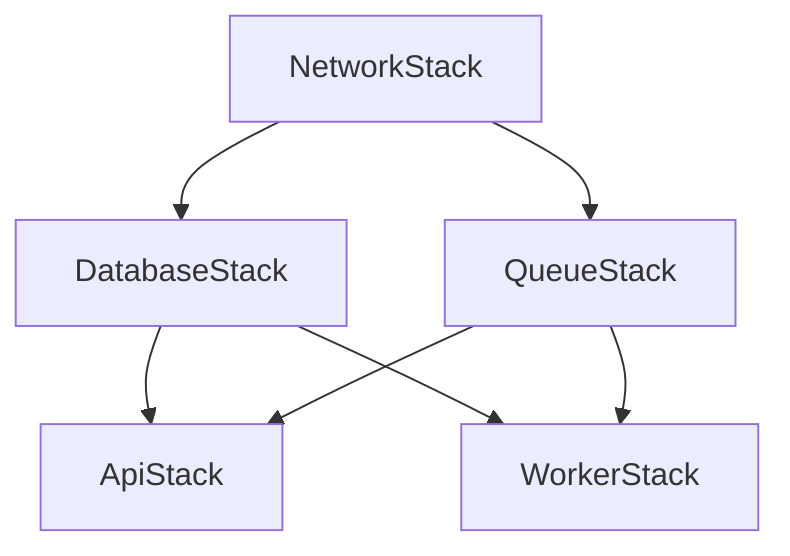

# CDK Infrastructure Plan

## Overview
Hybrid AWS infrastructure using CDK with:
- **Aurora PostgreSQL Serverless v2** for database
- **Express API on ECS Fargate** for API server
- **Lambda functions** for background notification processing
- **SQS** for queue management

## Project Structure

```
cdk-infrastructure/
├── bin/
│   └── app.ts                          # CDK app entry point
├── lib/
│   ├── stacks/
│   │   ├── network-stack.ts            # VPC, subnets, security groups
│   │   ├── database-stack.ts           # Aurora Serverless v2 PostgreSQL
│   │   ├── api-stack.ts                # Fargate service + ALB
│   │   ├── queue-stack.ts              # SQS queues + DLQ
│   │   └── worker-stack.ts             # Lambda notification processors
│   ├── constructs/
│   │   ├── fargate-api-service.ts      # Reusable Fargate construct
│   │   └── notification-worker.ts      # Reusable Lambda worker construct
│   └── config/
│       ├── dev.ts                      # Dev environment config
│       ├── staging.ts                  # Staging config
│       └── prod.ts                     # Production config
├── package.json
└── cdk.json
```

## Stack Details

### 1. NetworkStack (Foundation Layer)

**Purpose**: Core networking infrastructure

**Resources**:
- VPC (multi-AZ for high availability)
- Public subnets (for Application Load Balancer)
- Private subnets (for Fargate tasks and Lambda functions)
- Isolated subnets (for Aurora database)
- NAT Gateway (for private subnet internet access)
- Security Groups (network access control)

**Configuration**:
```typescript
VPC CIDR: 10.0.0.0/16
Availability Zones: 2-3
Public Subnets: /24
Private Subnets: /24
Isolated Subnets: /24
```

### 2. DatabaseStack

**Purpose**: Persistent data storage

**Resources**:
- Aurora Serverless v2 Cluster (PostgreSQL engine)
  - **Min capacity**: 0.5 ACU (development/staging)
  - **Max capacity**: 4-8 ACU (production, scalable based on load)
- AWS Secrets Manager (database credentials)
- Security Group (restricts access to app subnets only)
- Optional: Read replica for read scaling

**Features**:
- Auto-scaling based on load
- Automatic backups (point-in-time recovery)
- Encryption at rest
- Multi-AZ deployment for HA

### 3. QueueStack

**Purpose**: Asynchronous message processing

**Resources**:
- SQS Standard Queue (for notification messages)
- Dead Letter Queue (DLQ for failed messages)
- CloudWatch Alarms:
  - Queue depth monitoring
  - DLQ message count alerts
  - Age of oldest message

**Configuration Options**:
- Standard Queue: High throughput, at-least-once delivery
- FIFO Queue: Ordered processing (if needed)
- Visibility timeout: 30-300 seconds (based on processing time)
- Message retention: 4-14 days

### 4. ApiStack (Express on Fargate)

**Purpose**: RESTful API server

**Resources**:
- Application Load Balancer (ALB)
  - HTTPS listener (with ACM certificate)
  - Health check endpoint
- ECS Cluster
- Fargate Service
  - Task Definition (Node.js Express container)
  - Auto-scaling policies:
    - CPU-based (target 70%)
    - Memory-based (target 80%)
    - Request count per target
  - Min tasks: 1
  - Max tasks: 10 (adjustable)
- Amazon ECR Repository (Docker image storage)
- CloudWatch Logs (application logs)
- IAM Task Role (permissions for AWS services)

**Container Configuration**:
```
CPU: 512 (0.5 vCPU) - 1024 (1 vCPU)
Memory: 1GB - 2GB
Health Check: GET /health
Port: 3000
```

**Environment Variables**:
- `DATABASE_URL` (from Secrets Manager)
- `QUEUE_URL` (SQS queue URL)
- `AWS_REGION`
- `NODE_ENV`
- `LOG_LEVEL`

### 5. WorkerStack (Lambda Processors)

**Purpose**: Background notification processing

**Resources**:
- Lambda Function(s)
  - Runtime: Node.js 20.x
  - Memory: 512MB - 1GB
  - Timeout: 60-300 seconds
  - Reserved concurrency: 10-50 (prevent overwhelming DB)
  - VPC configuration (access to Aurora)
- EventSource Mapping (SQS → Lambda)
  - Batch size: 10 messages
  - Batch window: 5 seconds
  - Partial batch response (re-queue failed items)
- IAM Role
  - SQS read permissions
  - Aurora VPC access
  - CloudWatch Logs write
  - Secrets Manager read
- CloudWatch Alarms
  - Error rate
  - Duration
  - Throttles

**Processing Pattern**:
```
SQS → Lambda (batch of 10) → Process → Aurora
                           → Failures → DLQ
```

## Stack Dependencies



**Deployment Order**:
1. NetworkStack (base infrastructure)
2. DatabaseStack + QueueStack (can deploy in parallel)
3. ApiStack + WorkerStack (can deploy in parallel)

## Environment Configuration

### Development
```typescript
{
  aurora: {
    minCapacity: 0.5,
    maxCapacity: 2
  },
  fargate: {
    minTasks: 1,
    maxTasks: 2,
    cpu: 512,
    memory: 1024
  },
  lambda: {
    reservedConcurrency: 5
  }
}
```

### Staging
```typescript
{
  aurora: {
    minCapacity: 0.5,
    maxCapacity: 4
  },
  fargate: {
    minTasks: 1,
    maxTasks: 5,
    cpu: 1024,
    memory: 2048
  },
  lambda: {
    reservedConcurrency: 10
  }
}
```

### Production
```typescript
{
  aurora: {
    minCapacity: 1,
    maxCapacity: 8
  },
  fargate: {
    minTasks: 2,
    maxTasks: 10,
    cpu: 1024,
    memory: 2048
  },
  lambda: {
    reservedConcurrency: 50
  }
}
```

## Cost Optimization Strategies

1. **Aurora Serverless v2**
   - Scales down to 0.5 ACU when idle
   - Pay only for actual capacity used
   - Est: $0.12/ACU-hour (~$43/month at 0.5 ACU 24/7)

2. **Fargate**
   - Right-size tasks (start small, scale up)
   - Use scheduled scaling (scale down at night)
   - Est: $15-30/month per task running 24/7

3. **Lambda**
   - Only pay per invocation
   - Free tier: 1M requests/month
   - Est: Nearly free for moderate workloads

4. **SQS**
   - First 1M requests/month free
   - $0.40 per million requests after
   - Est: Nearly free for most workloads

5. **NAT Gateway**
   - Most expensive component (~$32/month + data)
   - Consider NAT instance for dev environments

**Estimated Monthly Costs**:
- **Dev**: $50-100/month
- **Staging**: $100-200/month
- **Production**: $200-500/month (low-medium traffic)

## Security Considerations

1. **Network Security**
   - Aurora in isolated subnets (no internet access)
   - Fargate in private subnets (outbound via NAT)
   - ALB in public subnets (HTTPS only)

2. **Secrets Management**
   - All credentials in Secrets Manager
   - Automatic rotation enabled
   - IAM-based access control

3. **IAM Roles**
   - Least privilege principle
   - Separate roles for API and Workers
   - No long-lived credentials

4. **Encryption**
   - Aurora: Encryption at rest
   - SQS: Encryption at rest and in transit
   - ALB: TLS 1.2+ only

## Monitoring & Observability

1. **CloudWatch Dashboards**
   - API latency, error rate, throughput
   - Aurora connections, CPU, queries
   - SQS queue depth, age
   - Lambda duration, errors, throttles

2. **Alarms**
   - High error rate (API, Lambda)
   - Database connection pool exhaustion
   - Queue backing up (depth > threshold)
   - DLQ has messages

3. **Logging**
   - Centralized in CloudWatch Logs
   - Structured JSON logging
   - Log retention: 30 days (adjustable)

4. **Tracing (Optional)**
   - AWS X-Ray integration
   - Request flow visualization
   - Performance bottleneck identification

## Next Steps

1. **CI/CD Pipeline** - Automated deployment strategy
2. **Express API Structure** - Application architecture
3. **Database Migrations** - Schema management strategy
4. **Testing Strategy** - Unit, integration, e2e tests
5. **Local Development** - Docker Compose setup
